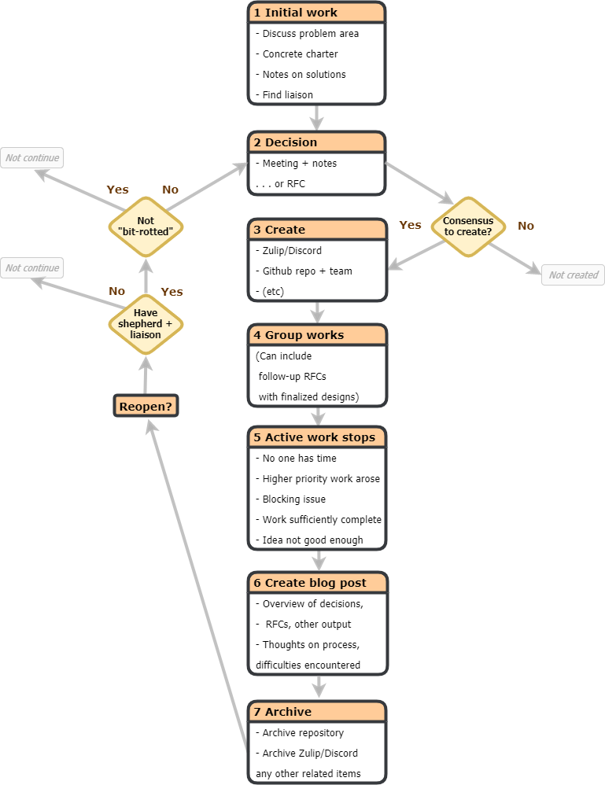

# Working Group RFC

# Summary

- Formalize project groups as groups dedicated to completing specific projects
  within the context of a Rust team
- Project groups are created via an RFC and have a "parent team" (or
  multiple teams)
- The groups then drive the project to completion, e.g. by authoring follow-up
  RFCs and doing design work.
- Each project group typically has:
  - A charter outlining the group's scope and goals.
  - Appointed shepherds and team liasons.
  - An associated repository.
  - Regular meetings.
  - Dedicated streams on Discord/Zulip/etc.
- Define working groups to refer to the "domain working groups" that are created
  to explore particular domains, such as embedded, CLI, etc.
  - They have a charter and defined leads but operate more independently from
    the Rust teams.
- Define community group as the term for groups not formally affiliated with the
  Rust project.

# Motivation

Working groups were not created through the RFC process, as such there's not
much documentation on exactly what a working group does, what are its
responsibilities, and also importantly setting expectations or goals. There is
one definition of "Working Group" available in [rust-lang#54445]; quoted below.

> A Rust Working Group is a set of people working at common purpose. Working
> Groups are associated with a Rust team. Unlike a Rust Team, Working Groups
> don't have "formal decision making power", though often they are charged with
> drawing up recommendations, RFCs, or other documents for the teams (which is
> then intended to make the final decision).

While this definition is true in the broad sense, it does not define the
difference between what has come to be called "Domain Working Groups" and
"Team Working Groups". Additionally the community has also adopted the Working
Group terminology for organising and working on areas they are interested in,
independent of The Rust Programming Language's Working Groups. It's great that
we have a community able to self organise in this way, however it has led to
some confusion over who is supporting these efforts, and whether they're
considered _"official"_ Working Groups.

This RFC aims to provide clarity by providing new distinct terminology that
matches the intent behind each of these three separate groups, as well as codify
the processes that these groups have been using to help facilitate creating
new groups.

[rust-lang#54445]: https://github.com/rust-lang/rust/issues/54445

# Guide-level explanation

To address this confusion this RFC proposes breaking up the single "Working
Group" term, into three distinct terms.

- **Working Group** would map most directly to the previous "Domain Working
  Group" terminology, focused on building and organising around new areas of
  Rust that aren't covered by the current team roster.
- **Project Group** would replace the "Team Working Group", and would serve as a
  catch all term for sub teams for the existing teams to organise around
  specific efforts, such as certain project or effort in the Rust team.
- **Community Group** would act as a catch all term for community self
  organising groups that are independent of the Rust Programming
  Language Organisation.

## Lifecycle of a Project Group

This is a high level overview of the complete process of a project group. While
the flow is built around project groups, we expect that working groups would
follow a similar process with only minor specifics changed. E.g. A working
group does not have to find a liaison.

    
    
Figure 1. Project Group Lifecycle

1. Exploratory period.

- Initial discussions of the problem area.
- Write a charter containing motivation, and some notes on
  possible solutions.
- Find a person from the relevant team who's willing to act as a liaison.
  - Typically can find someone by creating a post on [internals] or pinging
    specific people from team to gauge their interest.

2. Obtain consensus to create group.

- Specify the liaison, and shepherd(s).
- How consensus is reached would vary from team to team, some would require an
  RFC while others could decide in a meeting. (See [Future Work](#future-work))

3. Create infrastructure for group.

- GitHub repository under `rust-lang` for hosting work and discussions, such
  as for draft RFCs.
- A Discord channel or a Zulip stream for communication.
- Project group in [`rust-lang/team`], as well as a team on GitHub, for
  handling permissions.

4. Create a post on the Rust or Inside Rust blog announcing creation of
   the group.

5. The group works towards the goals laid out in their charter.

6. When active work has stopped a group is "archived".

- Archival is not necessarily a permanent state, it is only a reflection on the current
  status of the group. A group can be "restored" at a later stage.
- Reasons to archive:
  - Nobody in the group has time anymore or higher priority things arose.
  - There's a blocking issue that can't be resolved.
  - Don't see any additional work to do in this area in the near future.
  - The work was done to a satisfactory state.
  - The group decided the idea wasn't so good after all.

7. Create a blog post announcing the archival of the group.

- The scope of this post will vary based on the scope of the group, but
  ideally it would include some of the following.
  - Overview of decisions, RFCs, and other output the group produced.
  - Thoughts on the process, how it worked (or didn't as case may be), any
    difficulties encountered, and what they would want to be improved.

8. Archive infrastructure.

- Archive GitHub repository to be read-only.
- Archive chat channel(s) on any platforms.

9. (Optional) Restore group

- At any later point the group could be restored to active status if there are
  assigned liaisons and shepherds, and the group has consensus from the team
  that the group should become active again.
- If significant time has passed, part of restoring the group should be to
  evaluate whether the past decisions and rationale are still applicable to the
  present.
- If there is consensus to become active again, go to step 3.

[`rust-lang/team`]: https://github.com/rust-lang/team
[internals]: https://internals.rust-lang.org

# Reference-level explanation

## Common Aspects of Working Groups and Project Groups

Before going into the differences between these groups it's important to start
with what it is shared between them.

- A charter that defines the scope and intent of the group.

- A GitHub repository hosted under the `rust-lang` organization
  (or separate organisation if necessary) containing the charter and
  instructions for how community members can monitor or participate in
  the group.

- Groups have at least one shepherd who acts as the leader of the group and is
  typically responsible for writing the initial charter, handling administrative
  and communication tasks, as well as delegating responsibilities to other
  members in the group.

- Groups should have a liaison member associated with an official Rust team.

  - This liaison may also be but is not required to be a shepherd.

- Groups and their members are represented on the official
  [rust-lang.org] website.

- Membership requirements for both groups is decided by the shepherd and should
  be stated in the charter.

  - Initial membership should try to represent people who have already been
    participating regularly and productively in the respective area.

- Neither group has _"formal decision making power"_: meaning that they are not
  able to accept RFCs on `rust-lang/rfcs`. Similarly, neither group has
  representation on the Core team.

  - Groups are of course encouraged to create RFCs as well
    as advocate their concerns and desired changes to the Rust teams
    and community.

- Both groups are entitled to spaces in any or all of Rust's officially managed
  discussion forums.

  - As the time of this writing this includes [Zulip] and [Discord].
  - Groups are also free to create spaces on platforms where the Rust project
    does not have a official presence. Moderation for these spaces should still
    follow Rust's [Code of Conduct].

[rust-lang.org]: https://rust-lang.org
[zulip]: https://rust-lang.zulipchat.com
[discord]: https://discord.gg/rust-lang
[code of conduct]: https://www.rust-lang.org/policies/code-of-conduct

### Initial Setup

Once a group has been approved, a pull request with the initial set of members
should be made to [`rust-lang/team`]. Please refer to team's documentation for
how to create a group.

It is recommended for the working group to create a `wg-{name}`/`project-{name}`
repository under the `rust-lang` organisation using the [project group
template], and making any relevant changes and personalisation.

[`rust-lang/team`]: https://github.com/rust-lang/team
[project group template]: https://github.com/rust-lang/project-group-template

## Working Groups

Working groups are a way of finding new domains that would benefit from
continual development, that are not covered by an existing Rust team. Examples
of this include [Embedded][embedded-wg], [WebAssembly][wasm-wg], and
[Game Development][gamedev-wg].

[embedded-wg]: https://github.com/rust-embedded/wg
[wasm-wg]: https://github.com/rustwasm/team
[gamedev-wg]: https://github.com/rust-gamedev/wg

### Working Group Creation

Creation of a working group is approved by the core team. Typically this has
been done by the core team agreeing to approve the creation of new working
groups, having a period of time soliciting applications from the community,
and then approving a subset of those applications.

#### Application Checklist

This not meant to be formal list of questions to be answer, however the
application should try to address these points.

- What value do you see your group bringing to the organisation?
- Why should the project your group?
- What are the goals of your group?
- What are explicitly non-goals of your group?

These first four points should also serve as the basis for the charter for the
working group.

- Is your group long-running or temporary?
  - If it is temporary, how long do you see it running for?
- What is the long-term vision of your group?
- What do you expect the relationship to the organisation be?
- How do you want to establish accountability?
- If applicable, which other working groups or teams do you expect to have close
  contact with?
- What are the short-term goals of your group?
- Who are the initial shepherds/leaders? (This is preferably 2–3 individuals,
  but not required.)
- How do you intend to make your work accessible to people outside your group?
- Where do you see your group needing help?
- What is your preferred way for the core team to contact you?

### Working Group Evaluation

Working group shepherds should be regularly participating in the project leads
discussion channels so that the rest of the organisation is aware of the work
and can help where needed.

If a working group has demonstrated consistent productivity over a significant
period time, and there is consensus that there is significant future work, it
may become a Rust team. Conversely if there is consensus that the work is
"complete" to the point that there's there is little benefit to continuing the
working group, it may be archived.

## Project Groups

A Project Group is a group of people working on a particular project or
responsibilities at the behest of an official Rust team. Examples of this would
include [FFI Unwind], [Inline ASM], and [Safe Transmute].

The goal of a project is build a community or formalise and existing community
around a particular feature or project in the in the organisation, and use this
space to discuss and iterate on that feature.

Part of building a community is removing some of the institutional memory that
develops in the design process, and centralising the information and discussion
around the feature so that we can provide better visibility into why certain
decisions and trade offs were made over others.

Previously a lot of the discussion and iteration for large features would
happen in the initial RFC thread. This leads to a lot of discussion in the top
of the thread and that has can become completely irrelevant to the current
iteration.

This process has also been unsuitable to describe features that can take
multiple years to develop and will become multiple RFCs over the course of its
design process. Some examples of of this are the "`impl Trait`" and "macros
2.0" features, where the goals has shifted a lot from the initial RFCs, and it
can be hard to know their current status.

### Project Group Creation

Since project groups are approved by their relevant parent team over the core
team, it's up to each team decide their specific requirements. However we
recommend using the [application checklist](#application-checklist) as the basis
for process and if needed adding any extra requirements.

Process around project group membership is up to the shepherd's discretion.
Typically, people who are productively contributing to the project group for
some time will be added as members. It is not required for a project group to
have alot of members though, some project groups may only have one or
two members.

### Project Group Evaluation

Parent teams should add checking in with their project groups as part of their
regular triage.

[ffi unwind]: https://github.com/rust-lang/project-ffi-unwind
[inline asm]: https://github.com/rust-lang/project-inline-asm
[safe transmute]: https://github.com/rust-lang/project-safe-transmute

## Community Groups

Community Groups are groups of individuals who want to work and collaborate on a
specific topic, without going through the formal process of a working group.
Community groups are encouraged to adopt the structure of working or projects
groups laid, but are free create and experiment with their own structure. As
such community groups are not officially endorsed by The Rust Programming
Language Organisation.

## Archival

The archival process of a group involves communicating the wind down to the
community and the archival or transfer of ownership of the relevant projects.
As well archiving any chat channels hosted by the Rust project.

### Retrospectives

While this RFC attempts to address some of the current organisational problems
within the organisation, it also doesn't believe that this RFC will be a panacea
to those problems or that we won't encounter more in the future. As part of
that, we'd also like to introduce performing retrospectives with groups, once
significant time has past or the group has been finished it's project.

This would involve a discussion between the members of the group, and ideally
their parent team and the Governance working group. The retrospective should
produce a public blog post on the Inside Rust blog, however any feedback a
member has that they would want to keep private would be omitted.

The blog post should try to cover the output of the group, such as RFCs or
projects, as well what the group thought worked and importantly what
didn't work. This should help us iterate on this initial RFC and help us find
and address issues that come up in the process.

# Drawbacks

- This will add organisational overhead to maintain group repositories
  and documents.
- There's a lot of inertia around the Working Group terminology, and switching
  to new terminology will likely also cause some confusion, though hopefully
  only in the short term.

# Future Work

- Ideally we'd prefer if every team obtained consensus to form groups through
  RFCs, as they an open process that allows us to easily keep track of
  decisions. However we recognise that the current RFC process is maybe too
  heavyweight for some teams currently. We're currently looking how we can
  simplify some of this process, see [wg-governance#38] for further information.

[wg-governance#38]: https://github.com/rust-lang/wg-governance/issues/38

# Unresolved questions

[unresolved-questions]: #unresolved-questions

- The term _"shepherd"_ term has been used extensively in the Rust project and
  the community to describe leaders of teams however there hasn't ever been a
  strict definition and this could come with different expectations of what is
  expected from a shepherd. This RFC does not attempt to define this, however
  there are few resources that are helpful to understanding the terminology.

> - [Niko Matsakis' "AiC: Shepherds 3.0"][niko-sheps]
> - [James Munns' "Shepherding v3.1"][james-sheps]

[niko-sheps]: http://smallcultfollowing.com/babysteps/blog/2019/09/11/aic-shepherds-3-0/
[james-sheps]: https://jamesmunns.com/blog/shepherding-3-1/
